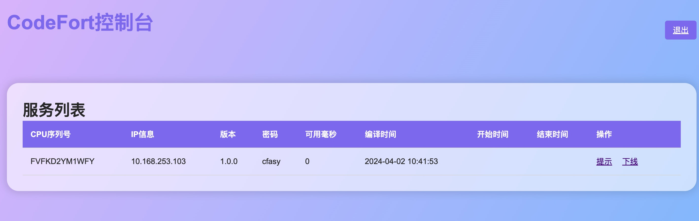
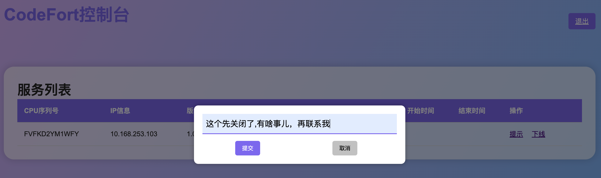

<h1 align="center" style="text-align:center;">

<br />
CodeFort v1.0.5
</h1>
<p align="center">
	<strong>Java 字节码加密插件，配置简单、多种方式、远程管理！</strong>
</p>
<p align="center">
	<a href="https://gitee.com/anoraks/codefort">https://gitee.com/anoraks/codefort</a>
</p>

<p align="center">
    <a target="_blank" href="https://central.sonatype.com/search?q=io.gitee.anoraks%3Acodefort-plugin">
       
    </a>
    <a target="_blank" href="LICENSE">
		
	</a>
    <a target="_blank" href="https://www.oracle.com/java/technologies/javase/javase-jdk8-downloads.html">
		
	</a>
    <br />
    <a target="_blank" href='https://gitee.com/anoraks/codefort/stargazers'>
		
	</a>
	</a>
	</a>
</p>
<br/>

-------------------------------------------------------------------------------

## 📚简介

`CodeFort`是一个用于class加密的**Maven插件**，通过诸多实用的策略配置，旨在帮助开发者简便，快捷的保护代码安全。

### 🎁CodeFort名称的由来

CodeFort = Code + Fort，“Code”是代码的表示，Fort表示堡垒。CodeFort寓意保卫代码安全。
## 🛠️包含组件
一个字节码加密的Maven插件，项目以下组件：

| 模块                |     介绍                                                                          |
| -------------------|---------------------------------------------------------------------------------- |
| codefort-core         |     核心代码模块                                              |
| codefort-plugin |     加密插件模块                                                |
| codefort-web       |     远程控制模块                                                                     |
-------------------------------------------------------------------------------

## 📦安装

### 🍊Maven
在项目的pom.xml的dependencies中加入以下内容:

```xml
<plugin>
    <groupId>io.gitee.anoraks</groupId>
    <artifactId>codefort-plugin</artifactId>
    <version>1.0.5</version>
    <configuration>
        <password>123456</password>
        <startTime>2017-03-01 22:33:23</startTime>
        <endTime>2027-03-01 22:33:23</endTime>
        <biosMark>FVFKD2YM1WFY</biosMark>
        <availableTime>1000</availableTime>
        <libs>license-client-2.0.jar</libs>
        <packages>host.skiree.springdemo</packages>
        <excludes>host.skiree.springdemo.excludes</excludes>
        <host>127.0.0.1</host>
        <port>7007</port>
        <explain>示例项目</explain>
        <isDebug>true</isDebug>
        <rsaPublicKey>RSA公钥</rsaPublicKey>
    </configuration>
    <executions>
        <execution>
            <phase>package</phase>
            <goals>
                <goal>CodeFort</goal>
            </goals>
        </execution>
    </executions>
</plugin>
```
-------------------------------------------------------------------------------

### 🐞提供bug反馈或建议

提交问题反馈请说明正在使用的JDK版本呢、CodeFort版本和相关依赖库版本。

- [Gitee issue](https://gitee.com/anoraks/codefort/issues)

## 使用
### 参数说明

| 参数                |     说明                                                                          |
| -------------------|---------------------------------------------------------------------------------- |
| password         |     加密密码(默认为：cfasy)                                              |
| startTime |     开始时间                                                |
| endTime       |     结束时间        
| biosMark       |     CPU序列号
| availableTime       |     剩余可用时间(单位：毫秒)
| libs       |     需要加密的依赖包,若多个逗号分隔
| packages       |     需要加密路径,若多个逗号分隔
| excludes       |     加密排除路径,若多个逗号分隔
| host       |     远程控制主机IP
| port       |     远程控制主机端口
| explain       |     项目说明
| isDebug       |     是否开启Debug
| rsaPublicKey       |     远程控制公钥

### 运行说明
如果正常打包的项目为 springdemo.jar,则会在通路下生成springdemo-encrypted.jar,运行下边的命令执行。
```bash
java -javaagent:springdemo-encrypted.jar -jar springdemo-encrypted.jar
```
输入密码后，如果配置了远程控制就可以在管理页面进行操作。
```
  _____        __    ____         __ 
 / ___/__  ___/ /__ / __/__  ____/ /_
/ /__/ _ \/ _  / -_) _// _ \/ __/ __/
\___/\___/\_,_/\__/_/  \___/_/  \__/ 

[13:45:07.217-INFO] 无法在运行参数中获取密码,将会从系统参数获取
[13:45:07.220-INFO] 无法在系统参数中获取密码,将会从控制台获取
[13:45:07.220-INFO] 提示: 如果未设置密码请直接回车键跳过
[13:45:07.220-INFO] 请输入密码 :
[13:47:30.250-DEBUG] Socket服务器IP: 127.0.0.1,端口: 7007
[13:47:30.260-DEBUG] 连接成功
[13:47:40.262-INFO] CodeFort 致力保卫您的代码安全, 联系QQ 2940397985
```
如下所示就是成功连接上了控制台

在控制台目前可以进行信息提示操作和强制下线操作,如下所示

```
[13:48:13.754-INFO] 这个先关闭了,有啥事儿，再联系我
[13:48:15.305-INFO] 此服务已被强制下线！如有疑问请联系管理员或开发者
```